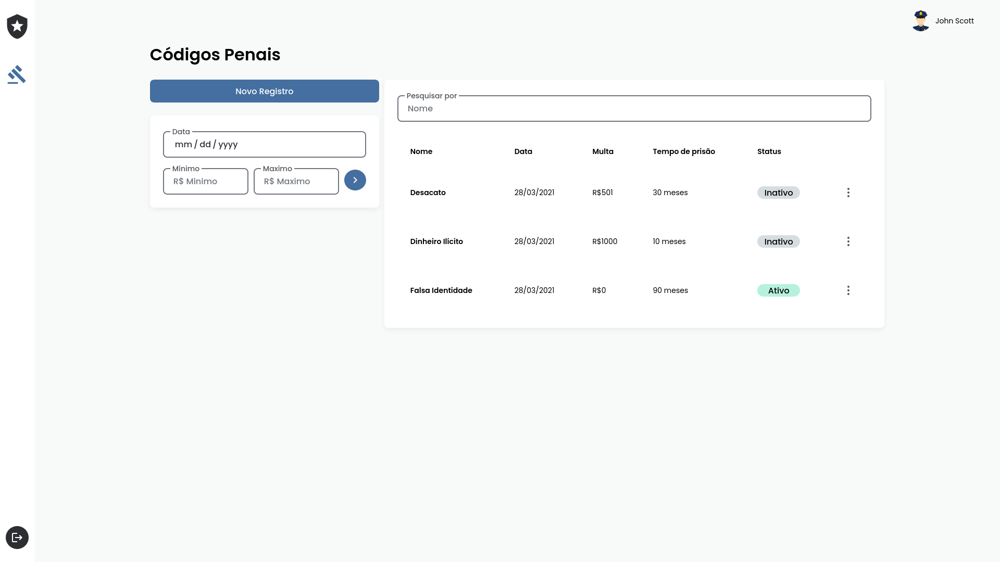

> 👨‍💻️ Desafio Front end Web - Cidade Alta.

### Sobre

Projeto consiste em um simples dashboard para controlar os códigos penais de dentro da cidade.

### Demo



[Deploy](https://challenge-cidade-alta.vercel.app)

### ⚡ Como iniciar

Instale as dependencias com o seu gerenciador de pacotes

Como **npm**

```bash
 npm install
```

Ou **yarn**

```bash
 yarn install
```

E inicialize o projeto em ambiente de desenvolvimento atravéz do comando:

```bash
 yarn dev
```

### 💻 Principais techs

- Nextjs
- Redux
- TypeScript
- Emotion
- Axios
